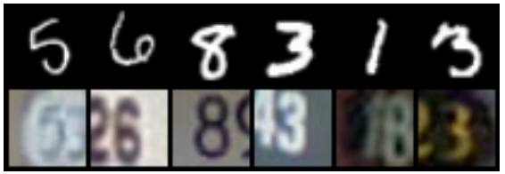
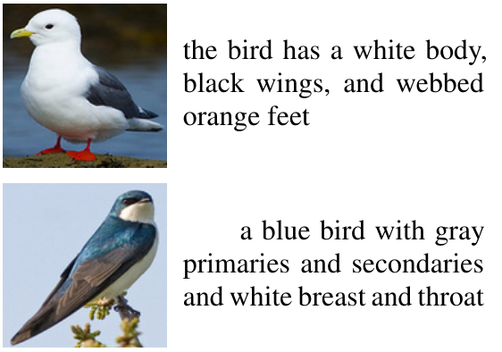
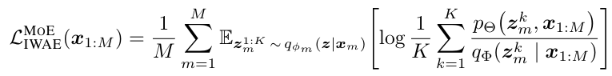

# Multimodal Mixture-of-Experts VAE
This repository contains the code for the framework in **Variational Mixture-of-Experts Autoencodersfor Multi-Modal Deep Generative Models** (see [paper](https://arxiv.org/pdf/1911.03393.pdf)).

## Requirements
List of packages we used and the version we tested the model on (see also `requirements.txt`)

```
python == 3.6.8
gensim == 3.8.1
matplotlib == 3.1.1
nltk == 3.4.5
numpy == 1.16.4
pandas == 0.25.3
scipy == 1.3.2
seaborn == 0.9.0
scikit-image == 0.15.0
torch == 1.3.1
torchnet == 0.0.4
torchvision == 0.4.2
umap-learn == 0.1.1
```

## Downloads
### MNIST-SVHN Dataset

<p></p>

We construct a dataset of pairs of MNIST and SVHN such that each pair depicts the same digit class. Each instance of a digit class in either dataset is randomly paired with 20 instances of the same digit class from the other dataset.

**Usage**: To prepare this dataset, run `bin/make-mnist-svhn-idx.py` -- this should automatically handle the download and pairing.

### CUB Image-Caption

<p></p>

We use Caltech-UCSD Birds (CUB) dataset, with the bird images and their captions serving as two modalities.

**Usage**: We offer a cleaned-up version of the CUB dataset. Download the dataset [here](http://www.robots.ox.ac.uk/~yshi/mmdgm/datasets/cub.zip). First, create a `data` folder under the project directory; then unzip thedownloaded content into `data`. After finishing these steps, the structure of the `data/cub` folder should look like:

```
data/cub
│───text_testclasses.txt
│───text_trainvalclasses.txt    
│───train
│   │───002.Laysan_Albatross
│   │    └───...jpg
│   │───003.Sooty_Albatross
│   │    └───...jpg
│   │───...
│   └───200.Common_Yellowthroat
│        └───...jpg
└───test
    │───001.Black_footed_Albatross
    │    └───...jpg
    │───004.Groove_billed_Ani
    │    └───...jpg
    │───...
    └───197.Marsh_Wren
         └───...jpg
```


### Pretrained network
Pretrained models are also available if you want to play around with it. Download from the following links: 
- [MNIST-SVHN](http://www.robots.ox.ac.uk/~yshi/mmdgm/pretrained_models/mnist-svhn.zip)
- [CUB Image-Caption (feature)](http://www.robots.ox.ac.uk/~yshi/mmdgm/pretrained_models/cubISft.zip)
- [CUB Image-Caption (raw images)](http://www.robots.ox.ac.uk/~yshi/mmdgm/pretrained_models/cubIS.zip)

## Usage

### Training

Make sure the [requirements](#requirements) are satisfied in your environment, and relevant [datasets](#downloads) are downloaded. `cd` into `src`, and, for MNIST-SVHN experiments, run

```bash
python main.py --model mnist_svhn

```

For CUB Image-Caption with image feature search (See Figure 7 in our [paper](https://arxiv.org/pdf/1911.03393.pdf)), run
```bash
python main.py --model cubISft

```

For CUB Image-Caption with raw image generation, run
```bash
python main.py --model cubIS

```

You can also play with the hyperparameters using arguments. Some of the more interesting ones are listed as follows:
- **`--obj`**: Objective functions, offers 3 choices including importance-sampled ELBO (`elbo`), IWAE (`iwae`) and DReG (`dreg`, used in paper). Including the `--looser` flag when using IWAE or DReG removes unbalanced weighting of modalities, which we find to perform better empirically;
- **`--K`**: Number of particles, controls the number of particles `K` in IWAE/DReG estimator, as specified in following equation:

<p align='center'></p>

- **`--learn-prior`**: Prior variance learning, controls whether to enable prior variance learning. Results in our paper are produced with this enabled. Excluding this argument in the command will disable this option;
- **`--llik_scaling`**: Likelihood scaling, specifies the likelihood scaling of one of the two modalities, so that the likelihoods of two modalities contribute similarly to the lower bound. The default values are: 
    - _MNIST-SVHN_: MNIST scaling factor 32*32*3/28*28*1 = 3.92
    - _CUB Image-Cpation_: Image scaling factor 32/64*64*3 = 0.0026
- **`--latent-dimension`**: Latent dimension

You can also load from pre-trained models by specifying the path to the model folder, for example `python --model mnist_svhn --pre-trained path/to/model/folder/`. See following for the flag we used for these pretrained models:
- **MNIST-SVHN**: `K=50, batch_size=256, cuda=True, epochs=50, experiment='mnist_svhn', latent_dim=20, learn_prior=True, llik_scaling=1, logp=False, looser=True, model='mnist_svhn', no_analytics=False, no_cuda=False, num_hidden_layers=1, obj='dreg', pre_trained=None, print_freq=0, projection=''`
- **CUB Image-Caption (feature)**: `K=50, batch_size=64, cuda=True, epochs=50, experiment='cubISft', latent_dim=64, learn_prior=True, llik_scaling=0.002, logp=False, looser=True, lr=0.0001, model='cubISft', no_analytics=True, no_cuda=False, num_hidden_layers=1, obj='dreg', std=0.0001`
- **CUB Image-Caption (raw images)**: `K=50, batch_size=64, cuda=True, epochs=200, experiment='cubIS', latent_dim=128, learn_prior=True, llik_scaling=0.0, logp=False, looser=True, lr=0.0001, model='cubIS', no_analytics=True, no_cuda=False, num_hidden_layers=1, obj='dreg', std=0.001`

### Analysing
We offer tools to reproduce the quantitative results in our paper in `src/report`. To run any of the provided script, `cd` into `src`, and

- for likelihood estimation of data using trained model, run `python calculate_likelihoods.py --save-dir path/to/trained/model/folder/ --iwae-samples 1000`;
- for coherence analysis and latent digit classification accuracy on MNIST-SVHN dataset, run `python analyse_ms.py --save-dir path/to/trained/model/folder/`;
- for coherence analysis on CUB image-caption dataset, run `python analyse_cub.py --save-dir path/to/trained/model/folder/`.


## Contact
If you have any question, feel free to create an issue or email Yuge Shi at yshi@robots.ox.ac.uk.
